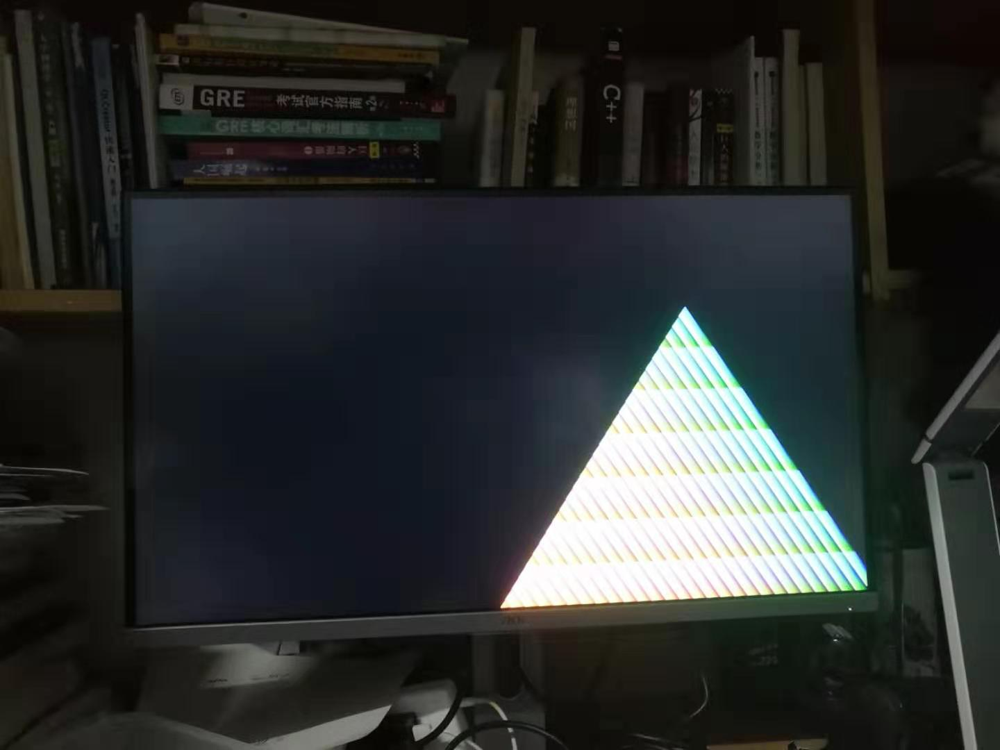
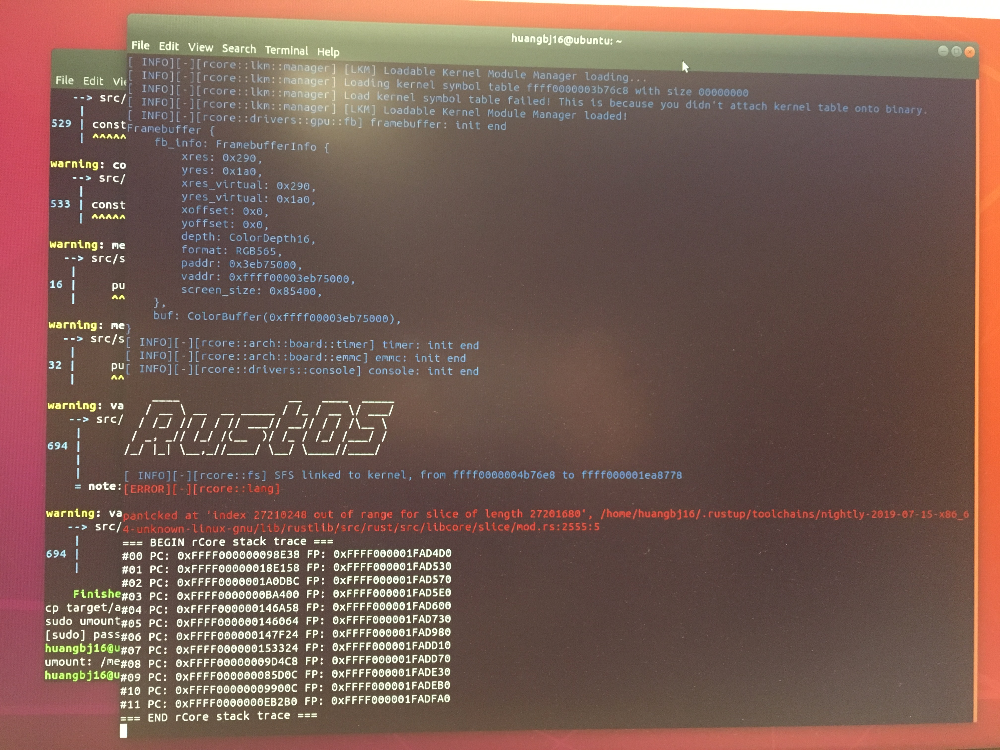

# rcore-vc4-opengl

#### rcore在raspberry pi 3B+上的移植，目标是实现Videocore IV的驱动，以及用rust写opengl的API。

#### 成员：孙桢波 黄冰鉴

#### 创建时间：2019/9/28

---

## 文献阅读与前期准备

#### 参考文档

[uCore plus 上 VideoCore IV 显卡驱动的移植与 OpenGL ES 的实现](<https://github.com/oscourse-tsinghua/OS2018spring-projects-g14/blob/master/report/final/doc.md>) by 贾越凯

[VideoCore IV官方文档](https://docs.broadcom.com/docs-and-downloads/docs/support/videocore/VideoCoreIV-AG100-R.pdf)

[Raspberry Pi 3B+介绍](<https://www.raspberrypi.org/products/raspberry-pi-3-model-b-plus/>)

## Weekly Progress

#### Week 5-6

孙桢波：用Rust重写了Hackdriver，放到内核模块中，调用framebuffer实现了在真机上画三角形。

黄冰鉴：阅读了rCore内核中kernel/Thread和kernel/Process部分的源码，尝试在Linux环境下生成Raspiberry Pi 3的rCore，串口和HDMI成功启动，输出了Rust OS，但是console没有加载成功，正在尝试debug。

