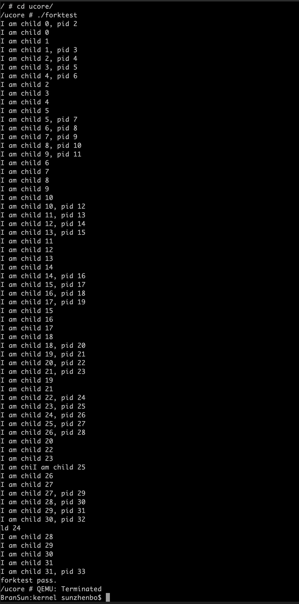

# 实验一：rcore代码注释和测试实验
计62 2016011277 孙桢波
---------------------
### forktest
```c++
#include <ulib.h>
#include <stdio.h>

const int max_child = 32;

int
main(void) {
    int n, pid;
    for (n = 0; n < max_child; n ++) {
        if ((pid = fork()) == 0) {
            cprintf("I am child %d\n", n);
            exit(0);
        }
        cprintf("I am child %d, pid %d\n", n, pid);
        assert(pid > 0);
    }

    if (n > max_child) {
        panic("fork claimed to work %d times!\n", n);
    }

    for (; n > 0; n --) {
        if (wait() <= 0) {
            panic("wait stopped early\n");
        }
    }

    if (wait() > 0) {
        panic("wait got too many\n");
    }

    cprintf("forktest pass.\n");
    return 0;
}
```

在运行forktest时，发现以下一些问题：
1. cprintf打印的序号均不正确
2. 子进程的pid出现重复的情况

#### 分析问题
1. 问题一原因：
    经过测试，打印的问题源于`ucore/src/lib`中的`getint()`函数。该函数使用了va_list的指针作为参数，但是va_list可能会将参数保存在寄存器中，所以使用会带来问题。（黄冰鉴同学也解决了这个问题并更新了对应的repository，可以直接使用他的解决方法）
   修改方式：
    将参数从va_list的指针改成va_list即可
2. 问题二原因：
    在rCore中，PROCESSES保存着当前所有进程的弱引用，如果某个进程的所有强引用被释放，则说明该进程已经结束，就可以将该进程的pid赋给新的进程。而进程的所有强引用都保存在其各个线程块中，当所有线程块都退出时，该进程也结束，所以就带来了测试样例中的问题。
   修改方式：
    将PROCESSES中存在的已经完全释放的弱引用视作僵尸进程，在父进程调用wait时，从PROCESSES中删除该弱引用。同时在分配pid时，只分配PROCESSES中不存在的pid。

#### 结果
能够正常运行，结果如下：
