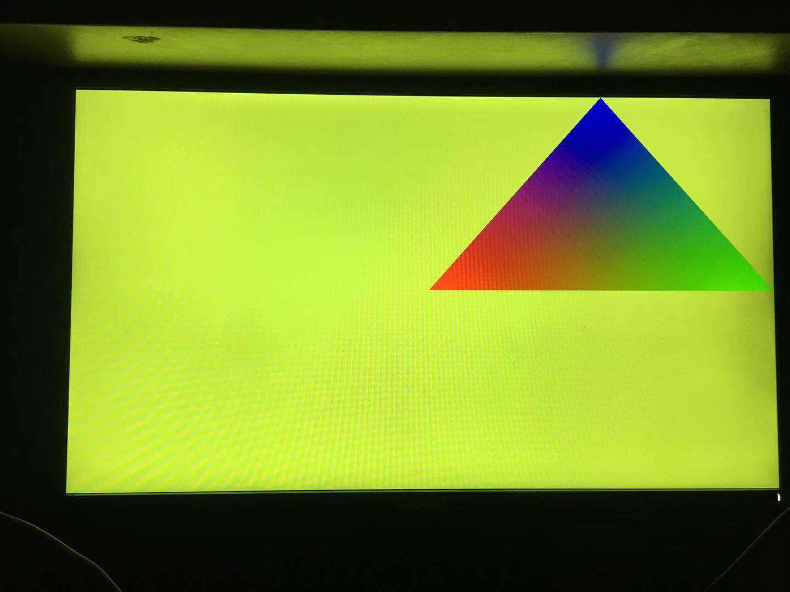
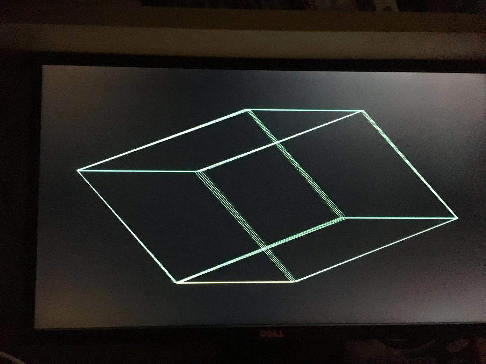
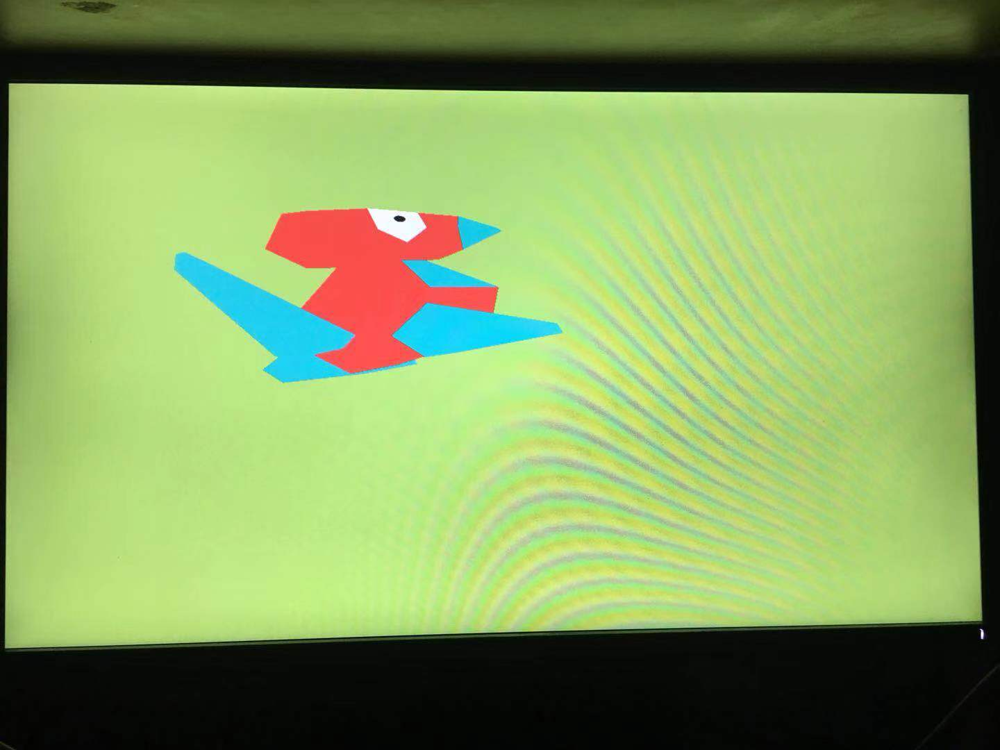
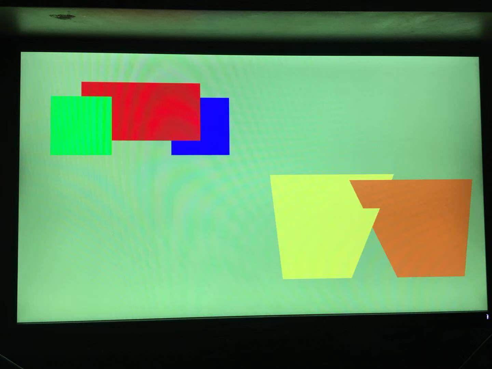
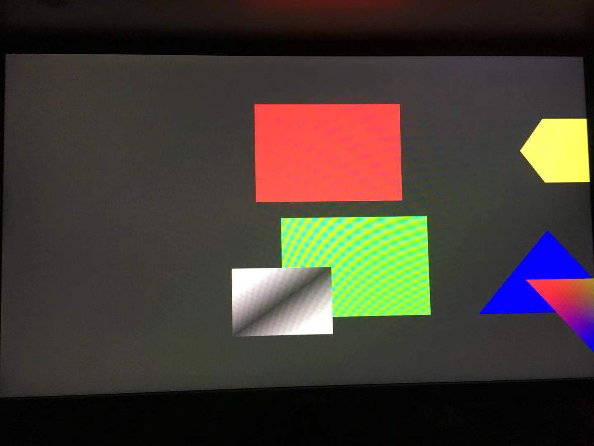

# VideoCore IV GPU Driver for rCore on Raspberry Pi 3B+


### General Description

OsTrain2019 Group 2 [Link](http://os.cs.tsinghua.edu.cn/oscourse/OsTrain2019/g2)

本项目旨在Raspberry Pi 3B+的环境下，在rCore中为VideoCore IV GPU实现驱动，并基于此驱动实现OpenGL ES的部分API，可以通过用户态调用OpenGL指令画出3D图形。

项目成员：孙桢波 黄冰鉴

项目日期：2019年9月28日--2019年12月31日


---


### Final Results

完成了学期初的目标,在rCore中实现Raspberry Pi 3B+的VideoCore IV GPU驱动，并且能够画出简单的2D/3D图形动画。

Samples:









Performance Comparison:

我们对比了使用驱动（anim/cube/porygon）和不使用驱动（Bad apple）两种情况下framebuffer refresh frequency。

| **app**   | **Frame rate** |
| --------- | -------------- |
| Bad apple | 46             |
| anim      | 625            |
| cube      | 455            |
| porygon   | 440            |

移植安全性保证：我们全部的移植仅存在19处unsafe操作，且都是无法避免的直接内存访问操作。因此我们认为从C到Rust的移植很好地增强了驱动的安全性。


---


### Literature Review

根据我们的调研，相关工作分为三部分。

##### rcore在Raspberry Pi上的移植 (by 贾越凯)
平台：Raspberry Pi 3

进展：在Raspberry Pi 3上实现了FrameBuffer以及在此基础上的console，可以通过修改FrameBuffer的方式在屏幕上画图。

##### ucore-plus在Raspberry Pi上对VideoCore IV GPU和OpenGL的支持 (by 贾越凯)
平台：Raspberry Pi Zero

成果：使用Rust实现了VideoCore IV GPU的驱动程序（在内核态和用户态下），补充了需要的syscall；
完成了一部分OpenGL的接口（另有一部分使用CPU实现尚未合并），可以在用户态调用OpenGL的API画3D图。

1. [Raspberry PI Zero V1.2](https://www.raspberrypi.org/products/raspberry-pi-zero/)，片上系统为 Broadcom BCM2835，包含一块 ARM1176JZF-S CPU 和 VideoCore IV GPU(VC4)，包含两个 Micro USB 接口(电源和数据)，一个 Mini HDMI 接口，可以使用串口进行通信

2. Mailbox：ARM CPU和VC4 GPU之间的信息通道，获得framebuffer大小、基址，请求、释放显存

3. framebuffer: 包括地址映射，系统调用等

##### Linux系统在Raspberry Pi上对VideoCore IV GPU的支持 (by Linux Developer Eric Anholt)
平台：Raspberry Pi上Linux系统

进展：最早是hackdriver，它使用 mmap 使得能够在用户态访问 V3D IO 地址和显存地址，将内存中的一段区域作为 framebuffer 进行绘制，并将渲染的结果(一个彩色三角形) dump 到文件中。

然后是在Linux内核中完成了对VideoCore IV的支持，包括DRM和Mesa。DRM(Direct Rendering Manager) 是对GPU进行动态调度的子系统。Mesa3D 是开源的 OpenGL (ES) 实现，它将 OpenGL 函数翻译为 GPU 命令，通过 ioctl 传给 DRM 来完成绘制。

##### 参考代码及文献

[uCore plus 上 VideoCore IV 显卡驱动的移植与 OpenGL ES 的实现](https://github.com/oscourse-tsinghua/OS2018spring-projects-g14/blob/master/report/final/doc.md)

[Mesa support for VC4](https://github.com/mesa3d/mesa/tree/master/src/gallium/drivers/vc4)

[Linux DRM support for VC4](https://github.com/raspberrypi/linux/tree/rpi-4.14.y/drivers/gpu/drm/vc4)

[hackdriver](https://github.com/phire/hackdriver)

[rCore offcial project](https://github.com/rcore-os/rCore)

[Raspberry Pi 3B+ Introduction](https://www.raspberrypi.org/products/raspberry-pi-3-model-b-plus/)

[VideoCore IV Documentation](https://docs.broadcom.com/docs-and-downloads/docs/support/videocore/VideoCoreIV-AG100-R.pdf)


---


### Program Structure

#### 内核态部分

我们基于rCore原本的架构，将Driver分为两部分放进了内核。

驱动的工作原理是：用户态可以申请分配GPU显存，通过mmap映射到用户态地址，并写入顶点、颜色等数据。此外，用户态构造Binning Control List（BCL）等信息后，调用`syscall::ioctl`传入内核态。内核态验证BCL的完整性，构造Render Control List（RCL），申请GPU的显存并用Buffer Object（BO）的形式组织，将CL的内容填入BO，将渲染任务提交给GPU执行。

**主要部分**位于`kernel/src/arch/aarch64/board/raspi3/vc4/`目录下，包含下列文件：

```
vc4
├── mod.rs
├── v3dReg.rs
├── vc4_bo.rs
├── vc4_drm.rs
├── vc4_drv.rs
├── vc4_gem.rs
├── vc4_packet.rs
├── vc4_render_cl.rs
├── vc4_validate.rs
```

各文件的具体说明如下：

* `mod.rs`：包含Driver初始化的入口`init()`，实现了针对GpuDevice类的创建实例函数`new()`和系统调用`syscall: io_control()`的入口。
* `v3dReg.rs`：定义了 V3D 寄存器的 IO 地址常量，参考[Linux](https://github.com/torvalds/linux/blob/master/drivers/gpu/drm/vc4/vc4_regs.h)。
* `vc4_bo.rs`：实现了对Buffer Object的一系列操作，如创建，释放，查找和映射等。
* `vc4_drm.rs`：定义若干结构体如`drm_vc4_create_bo`和`drm_vc4_free_bo`，是用户态和内核态之间传输数据的格式。
* `vc4_drv.rs`：仅定义了枚举类型`enum vc4_kernel_bo_type`，即区分不同类型的Buffer Object。
* `vc4_gem.rs`：构造了一个 `vc4_exec_info` 结构，生成BCL`vc4_get_bcl()`和RCL`vc4_get_rcl()`，并调用 `vc4_queue_submit()` 向 GPU 提交渲染Task。
* `vc4_packet.rs`：定义了 BCL 和 RCL 命令的编号、格式，参考[Linux](https://github.com/torvalds/linux/blob/master/drivers/gpu/drm/vc4/vc4_packet.h)。
* `vc4_render_cl.rs`：定义了GpuDevice类RCL相关的成员函数，如`vc4_get_rcl()`，`vc4_create_rcl_bo()`等。此外，还定义了`vc4_cl`类，是表示control list的结构体；以及对control list的填充函数`cl_u8()/cl_u16()/cl_u32()`。
* `vc4_validate.rs`：实现了若干函数，对用户态传入的数据进行正确性验证。

我们绘制了内部的调用关系图：


**Driver和rCore的连接部分**是`kernel/src/fs/gpu.rs`和`kernel/src/drivers/gpu/gpu_device.rs`。

- `kernel/src/fs/gpu.rs`：我们将GPU等同于VFS(virtual file system)的INode，在这个文件中定义了`syscall::ioctl`的入口，当用户态通过ioctl访问gpu时，就等同于访问文件系统中的一个文件。
- `kernel/src/drivers/gpu/gpu_device.rs`：定义了`struct gpu_bo`和`struct GpuDevice`，同时还定义了静态的`GpuDevice`对象`GPU_DEVICE`。

我们的思路是在`drivers`中定义通用的`GpuDevice`结构体，在`arch`中用`impl`的方法具体实现相关渲染函数。我们用这种方法实现了类似于C中的基类子类继承的关系，为以后的其它平台GPU驱动的扩展提供了接口和范例。


#### 用户态部分

用户态部分位于`rcore-user/videocore/`。其中包含许多内容，如渲染样例，OpenGL实现以及vc4的用户态驱动。

vc4驱动位于`rcore-user/videocore/libgl/src/drivers/vc4`目录下。我们并未对vc4的驱动做改动，因此在此不再赘述，详细描述信息可以参考[贾越凯的文档](<https://github.com/oscourse-tsinghua/OS2018spring-projects-g14/blob/master/report/final/doc.md>)。

渲染样例有`anim.c`，`shapes.c`，`z-test.c`，和新增的`porygon.c`，渲染效果在`section: Final Results`已有展示。我们新增的porygon.c中的3D模型有200+三角面片，可以很好地展示渲染性能。

我们补充了OpenGL API的实现，增加了对3D模型和旋转操作的支持。

我们修改了用户态原先面向x86的Atomic原子操作，改用gcc内置的原子操作。

---


### C-Rust Translation

在完成移植工作的同时，我们也在反思如何为之后做类似移植工作的同学提供帮助。

一方面，我们总结出了一个C-Rust Translation Guidelines，对移植中的一些通用技巧进行了总结。链接？？？

另一方面，我们针对现有翻译工具[C2Rust Translation Tool](<https://immunant.com/blog/2019/08/introduction-to-c2rust/>)进行了对比分析，指出了它可以借鉴的地方，以及存在问题的地方。链接？？？


---


### Conclusion

本次大实验，我们完成了以下目标：

- 在rCore上实现 Rust版本的VideoCore IV 的内核态驱动；
- 完善和补充了rCore的系统调用`io_unmap`和`io_control`。
- 对uCore中的VideoCore IV用户态驱动进行修改，适配rCore；

- 补充OpenGL API实现，增加了对3D模型和旋转操作的支持；

- 添加了新的渲染测试样例；
- C-Rust翻译的总结和对比分析。


#### Team Member Contribution

| 孙桢波                                                       | 黄冰鉴                                                       |
| ------------------------------------------------------------ | ------------------------------------------------------------ |
| 实现HackDriver<br/>移植内核部分的VC4驱动<br/>移植用户态部分的驱动<br/>补充系统调用<br/>真机调试<br/>补充OpenGL的3D旋转、平移 | 翻译内核部分的VC4驱动<br/>C2Rust工具分析<br/>调查用户态所需系统调用<br/>真机调试<br/>编写新的测试样例 |


#### Future work

完善OpenGL ES库：

- 增加对GLSL的支持；

- 完善其余功能，如光照，纹理。

移植miniGUI并适配当前的OpenGL。


