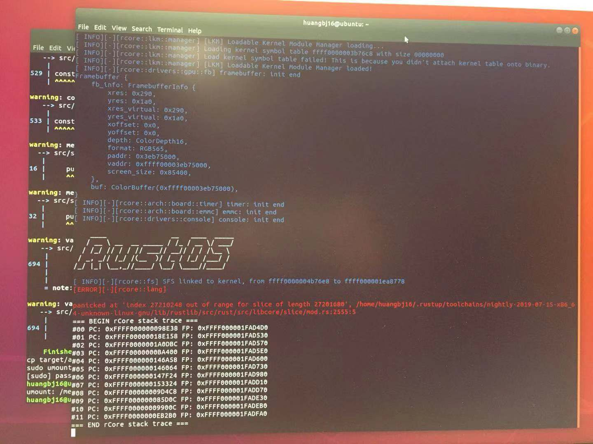

## Weekly Progress

#### Week 5-6

孙桢波：用Rust重写了Hackdriver，放到内核模块中，调用framebuffer实现了在真机上画三角形。

黄冰鉴：阅读了rCore内核中kernel/Thread和kernel/Process部分的源码，尝试在Linux环境下生成Raspiberry Pi 3的rCore，串口和HDMI成功启动，输出了Rust OS，但是console没有加载成功，正在尝试debug。

---

#### Week 6-7

黄冰鉴：成功配置好了Linux环境，生成了可用的aarch64 rCore Kernel，复现了孙桢波在mac环境下的成果。

